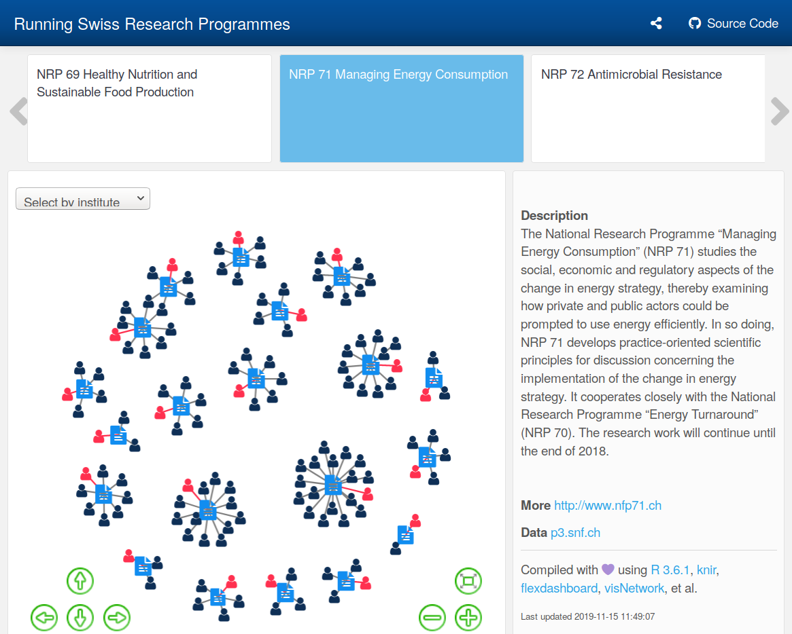

# nrpmap

<!-- badges: start -->
[](https://github.com/zambujo/NRPmap/blob/master/LICENSE) 
[](https://www.tidyverse.org/lifecycle/#experimental) 
[](https://mybinder.org/v2/gh/zambujo/nrpmap/master?urlpath=rstudio) 
<!-- badges: end -->


Exploring :switzerland: [National Research Programmes](https://www.sbfi.admin.ch/sbfi/en/home/research-and-innovation/research-and-innovation-in-switzerland/promotion-instruments/national-research-programmes-nrp.html) (NRP) based on [publicly available data](http://p3.snf.ch/Pages/DataAndDocumentation.aspx).



## Installation

To update/build `index.html`, launch `R` and run `source("install.R")` or open a terminal and type:

```
$ Rscript install.R
```

## Acknowledgments 

[](https://mybinder.org/v2/gh/zambujo/nrpmap/master?urlpath=rstudio) by [holepunch](https://karthik.github.io/holepunch/)
